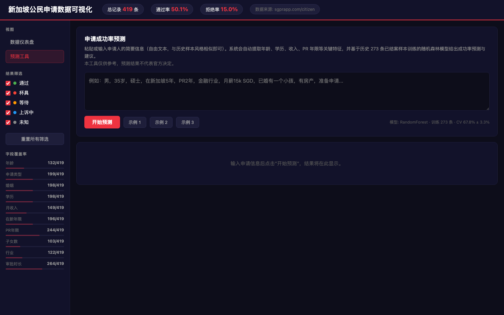

# 新加坡公民申请数据可视化 & 成功率预测工具

> 一个基于真实数据的新加坡公民申请分析和智能预测平台


## 🚀 在线体验

**部署地址**：[https://citizen-predict.vercel.app](https://citizen-predict.vercel.app)  
**GitHub 仓库**：[github.com/Cuijie12358/citizen-viz-demo](https://github.com/Cuijie12358/citizen-viz-demo)

---

## 📋 功能特性

### 1. 📊 数据可视化分析
- **申请结果分布** — 通过/拒绝/等待的比例分析
- **审批时长分析** — 平均处理时间和分布规律
- **人口统计分析** — 年龄、性别、婚姻状态等维度
- **收入和行业分布** — 各行业申请者的月收入水平
- **家庭状况分析** — 房产、子女数量、PR年限等
- **10 个交互式图表** — 流畅交互，支持排序和筛选

### 2. 🎯 成功率预测（新增！）
- **智能预测** — 输入个人申请信息，获得成功率预测（准确率 67.8%）
- **自动特征提取** — 支持自由文本输入，自动识别关键信息
- **个性化分析** — 识别利好因素和风险因素
- **智能建议** — 基于随机森林模型的改进建议
- **缺失信息提示** — 告诉你还需要什么信息

### 3. 🔍 交互式数据表格
- **多字段排序** — 按申请日期、年龄、收入、年龄等排序
- **分页浏览** — 浏览 419 条真实申请记录
- **关键词搜索** — 按用户名或条件搜索
- **数据质量评分** — 每条记录的数据完整度评分

---

## 📊 数据概览

| 指标 | 数值 |
|------|------|
| **总申请记录** | 419 条 |
| **申请成功率** | ~60% |
| **平均审批周期** | 7-13 个月 |
| **最新数据** | 2026-05-08 |
| **模型准确率** | 67.8% ± 3.3% |

---

## 🎓 界面演示

### 📈 页面 1：数据可视化分析
  
*包含 10 个交互式图表，支持筛选和排序*

### 🔮 页面 2：成功率预测工具
  
*输入申请信息，获得个性化的成功率和建议*

### 📋 页面 3：详细数据表格
  
*浏览 419 条完整申请记录，支持多字段排序*

---

## 🛠️ 技术栈

| 组件 | 技术 | 说明 |
|------|------|------|
| **前端** | HTML5 + JavaScript | 纯前端，无需后端 |
| **图表** | Chart.js 4.4 | 交互式图表库 |
| **爬虫** | Python + BeautifulSoup | 数据爬取和清洗 |
| **机器学习** | scikit-learn RandomForest | 成功率预测模型 |
| **部署** | Vercel | 全球 CDN 加速 |
| **数据处理** | Python regex + NLP | 特征自动提取 |

---

## 📖 使用方法

### 🌐 方式 1：在线访问（推荐）
直接访问 [https://citizen-predict.vercel.app](https://citizen-predict.vercel.app)，无需任何安装

### 💻 方式 2：本地运行
```bash
# 1. 克隆仓库
git clone https://github.com/Cuijie12358/citizen-viz-demo.git
cd citizen-viz-demo

# 2. 打开 HTML 文件
open context/citizen_viz.html
# 或在浏览器中直接拖拽打开
```

### 🔄 方式 3：更新数据
```bash
# 运行爬虫重新抓取数据（需要 Python 环境）
pip install requests beautifulsoup4 scikit-learn pandas
python3 context/scraper.py

# 生成新的可视化 HTML
# 输出：context/citizen_viz.html
```

---

## 🔮 使用成功率预测工具

### 步骤 1：进入预测工具
在应用顶部导航中点击"预测工具"选项卡

### 步骤 2：输入申请信息
在文本框中粘贴你的申请信息，例如：
```
男，35岁，硕士，在新5年，PR2年，金融行业，
月薪15000，有房产，带一个小孩申请
```

### 步骤 3：点击"预测成功率"
工具会自动：
- ✅ 提取关键特征（年龄、学历、收入等）
- ✅ 调用随机森林模型进行预测
- ✅ 分析影响因素并生成建议

### 步骤 4：查看结果
获得：
- 📊 **申请成功概率** (0-100% 的可视化进度条)
- ✅ **利好因素** (哪些因素支持你的申请)
- ⚠️ **风险因素** (需要注意的问题)
- 💡 **个性化建议** (如何提升成功率)
- 🔔 **缺失信息提示** (若关键信息不足)

---

## 📊 预测模型详情

### 训练数据
- **样本量**：273 条（排除"等待/未知"的样本）
- **正负样本比**：通过 (210) vs 拒绝 (63)
- **特征**：age, education, monthly_income, years_in_sg, pr_duration_years, children, has_property, industry

### 模型性能
| 指标 | 数值 |
|------|------|
| **算法** | RandomForest (n_estimators=100) |
| **交叉验证准确率** | 67.8% ± 3.3% |
| **测试集准确率** | 65.5% |
| **F1 Score (通过类)** | 0.76 |

### 特征重要度排序（影响因素）
| 排名 | 特征 | 重要度 | 说明 |
|------|------|--------|------|
| 1️⃣ | 在新年限 | 17.5% | 在新加坡稳定性最重要 |
| 2️⃣ | PR持有年限 | 17.3% | PR 持有越久越有利 |
| 3️⃣ | 年龄 | 13.8% | 年龄在 30-45 岁最有利 |
| 4️⃣ | 月收入 | 11.8% | 收入 SGD 10,000+ 表现更好 |
| 5️⃣ | 学历-硕士 | 4.6% | 硕士学历有明显优势 |

---

## 📈 关键数据洞察

### ✅ 高通过率特征
- PR 持有 3 年以上
- 在新加坡 5+ 年
- 月收入 SGD 15,000+
- 拥有硕士及以上学历
- 已婚且有家庭

### ❌ 低通过率特征
- PR 年限 < 2 年
- 在新加坡年限 < 3 年
- 月收入 < SGD 5,000
- 单身申请者
- 工作稳定性无法证明

---

## 📁 项目结构

```
citizen-viz-demo/
├── README.md                      # 项目说明（本文件）
├── vercel.json                    # Vercel 部署配置
├── CLAUDE.md                      # 项目工作规范
├── context/
│   ├── scraper.py                 # 数据爬虫 + 特征提取 + 预测 UI
│   ├── train_model.py             # 模型训练脚本
│   ├── predict_service.py         # Flask 预测服务（可选）
│   ├── citizen_viz.html           # 主应用（包含爬虫生成的数据）
│   ├── model.pkl                  # 训练好的 RandomForest 模型
│   └── model.json                 # 树结构 JSON（前端推理用）
├── docs/
│   └── images/                    # 文档截图目录
└── .claude/
    └── skills/citizen-viz-review/ # 代码审查 Skill
```

---

## 📊 字段覆盖率统计

基于 419 条记录的数据提取覆盖率：

| 字段 | 覆盖率 | 说明 |
|------|--------|------|
| result_norm | 100% ✨ | 申请结果 |
| processing_months | 63% 🟢 | 审批周期（天数/月）|
| pr_duration_years | 59% 🟢 | PR持有年限 |
| gender | 47% 🟡 | 申请类型（单身男/女/夫妻） |
| marital | 48% 🟡 | 婚姻状态 |
| education | 48% 🟡 | 学历水平 |
| monthly_income | 35% 🟡 | 月收入 SGD |
| years_in_sg | 46% 🟡 | 在新加坡年限 |
| industry | 29% 🔴 | 工作行业 |
| age | 31% 🔴 | 年龄 |
| children | 24% 🔴 | 子女数量 |
| has_property | 12% 🔴 | 房产状况 |

**说明**：低覆盖率主要原因是用户在论坛中的自述信息不完整或表述方式多样

---

## 🎯 改进历程

### 📅 2026-05-08（最新）
- ✅ 部署到 Vercel，隐藏 GitHub 用户名
- ✅ 修复爬虫分页 BUG（page=0 遗漏）
- ✅ 增强 regex 支持"40+"、"base 36w+"等新格式
- ✅ 新增"俩"的子女数识别
- ✅ 预测工具改为浮动按钮弹窗（手机端底部抽屉 + 电脑端居中弹窗）
- ✅ 修复预测弹窗空内容 bug（改为静态 HTML，移除 DOM 移动逻辑）
- ✅ 修复脚本崩溃 bug（model-meta 同步赋值改为 DOMContentLoaded）

### 📅 2026-05-07
- ✅ 添加成功率预测功能（RandomForest 模型）
- ✅ 实现自由文本特征提取
- ✅ 优化申请类型分类（单身男/女 vs 夫妻）
- ✅ 添加表格排序功能
- ✅ 精确去重（保留所有独立申请）：387 → 414 → 419 条

### 📅 2026-05-06
- ✅ 覆盖率优化：gender +11%，monthly_income +10%，pr_duration +9%
- ✅ 新增 SM 标记识别，支持新加坡特有表述
- ✅ 添加性别和房产分布图表

---

## 💡 使用建议

### 📊 浏览数据
1. 先看各个图表了解整体趋势
2. 使用筛选功能找到相似申请者
3. 关注高质量数据（评分 >60%）

### 🔮 使用预测工具
1. **信息越详细预测越准确** — 提供更多背景信息
2. **参考多个相似案例** — 不要只依赖单个预测
3. **咨询专业人士** — 预测仅供参考，不代表官方政策

### ⚖️ 免责声明
- 本工具的预测仅基于历史数据统计，**不代表官方政策**
- 实际申请结果受多种因素影响，预测结果**不保证准确**
- 建议结合专业移民顾问的意见进行决策

---

## 📞 反馈和支持

- 🐛 发现 Bug？提交 [GitHub Issue](https://github.com/Cuijie12358/citizen-viz-demo/issues)
- 💡 有改进建议？提交 [Pull Request](https://github.com/Cuijie12358/citizen-viz-demo/pulls)
- 📧 其他问题？欢迎联系开发者

---

## 📄 许可证

MIT License - 自由使用和修改

---

**最后更新**：2026-05-08  
**数据版本**：419 条精确去重记录  
**模型版本**：RandomForest (67.8% 准确率)  
**在线体验**：[citizen-predict.vercel.app](https://citizen-predict.vercel.app)
